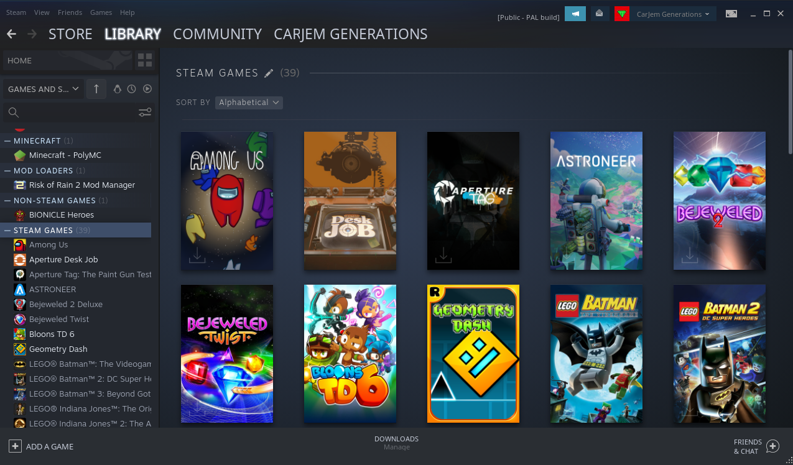
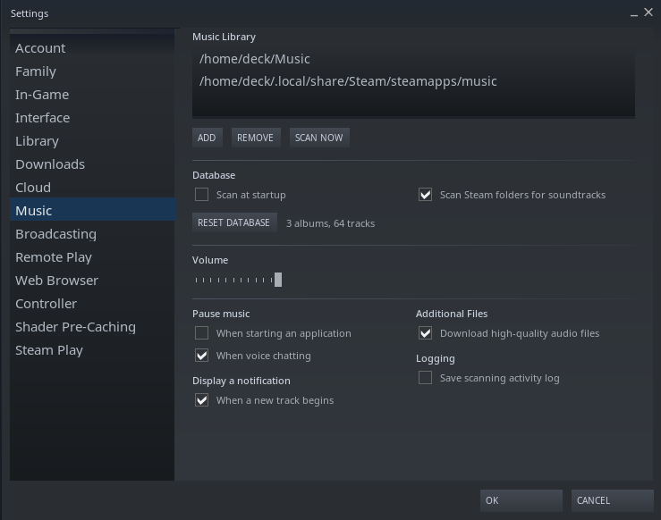
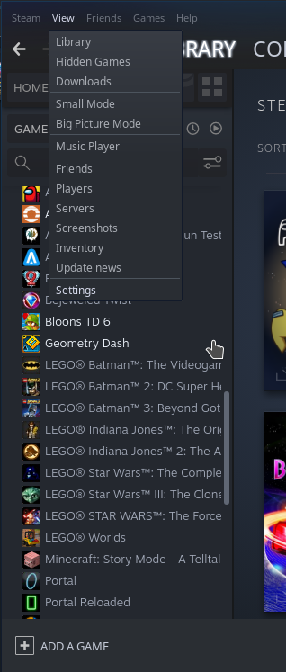
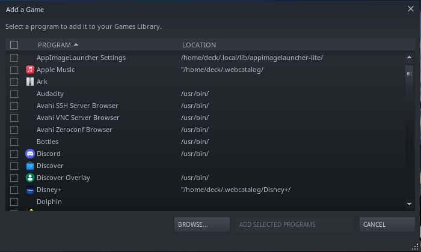

# Decktop-Tweaked [Steam Skin]

A Skin for Steam's Desktop Client, Designed for Steam Deck.
- Minimal Modifications to ensure easy updates and better compatibility
- Enforces Noto Sans instead of Monospace
- Reduced global font scale a tad to be more breathable

